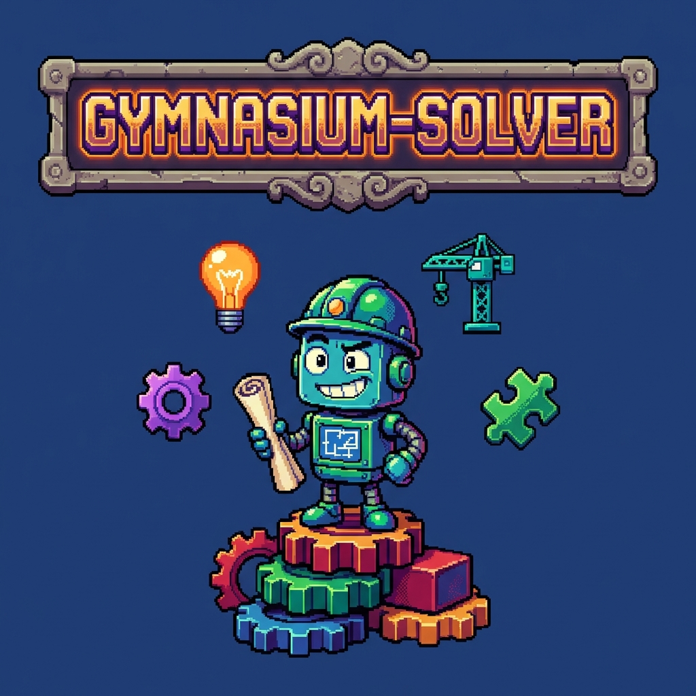

<div align="center">

  

  [](https://www.python.org/downloads/)
  [](https://opensource.org/licenses/MIT)
  [](https://lightning.ai/)
  [](https://wandb.ai/)
  [](https://huggingface.co/)

  **Train RL agents in minutes with config-first design, vectorized environments, and seamless W&B/HuggingFace integration**

  [Documentation](./CLAUDE.md) · [Issues](https://github.com/tsilva/gymnasium-solver/issues)

</div>

---

> **Development Status**: This is a self-education project undergoing rapid development. Expect instability and breaking changes until the first official release.

---

## Overview

gymnasium-solver is a PyTorch Lightning-based framework for training reinforcement learning agents on Gymnasium environments. Built for speed and flexibility:

- **Config-first**: YAML configurations with inheritance, variants, and hyperparameter schedules
- **Fast training**: Vectorized environments with automatic parallelism
- **Seamless integrations**: W&B logging, Hugging Face Hub publishing, MCP tools
- **Multiple algorithms**: PPO and REINFORCE with flexible policy architectures
- **Rich environment support**: Atari, VizDoom, Retro games, classic control, and custom environments

## Quick Start

### Installation

```bash
# Using uv (recommended)
pipx install uv
uv sync

# Using pip
python -m venv .venv && source .venv/bin/activate
pip install -U pip && pip install -e .
```

### Train Your First Agent

```bash
# Train PPO on CartPole (solves in ~30 seconds)
python train.py CartPole-v1:ppo -q

# List available environments
python train.py --list-envs
```

### Watch Your Agent Play

```bash
# Play the most recent trained agent
python run_play.py --run-id @last --episodes 5

# Launch interactive inspector UI
python run_inspect.py --run-id @last --port 7860
```

## Features

| Feature | Description |
|---------|-------------|
| **Algorithms** | PPO (clipped surrogate), REINFORCE (policy gradient with baselines) |
| **Vectorized Rollouts** | Sync/async execution with configurable parallelism |
| **Preprocessing** | Frame stacking, grayscale, resizing, normalization |
| **Schedules** | Linear interpolation for learning rates, clip ranges, entropy |
| **Checkpointing** | Automatic best/last tracking with symlinks |
| **Video Capture** | Episode recordings uploaded to W&B |
| **Inspector UI** | Gradio-based frame-by-frame visualization |
| **MCP Tools** | Programmatic training control and metrics retrieval |
| **Modal AI** | Remote training with automatic resource allocation |
| **W&B Sweeps** | Local and distributed hyperparameter optimization |

## Supported Environments

| Category | Examples | Notes |
|----------|----------|-------|
| Classic Control | CartPole, MountainCar, Acrobot, Taxi | Fast training, ideal for testing |
| Atari (ALE) | Pong, Breakout, Space Invaders | RGB/RAM/Objects observation modes |
| VizDoom | Basic, Deadly Corridor, Defend Center | First-person shooter scenarios |
| Retro | NES/SNES/Genesis games | Requires stable-retro |
| Box2D | LunarLander, BipedalWalker | Physics simulation |
| Custom | Multi-armed bandits | Extensible registry |

## Configuration

Configs live in `config/environments/*.yaml` with algorithm-specific variants:

```yaml
_base: &base
  env_id: CartPole-v1
  n_envs: 8
  eval_episodes: 10

ppo:
  <<: *base
  algo_id: ppo
  max_env_steps: 100000
  policy_lr: {start: 0.001, end: 0.0}    # Linear schedule
  clip_range: {start: 0.2, end: 0.05}

reinforce:
  <<: *base
  algo_id: reinforce
  max_env_steps: 200000
  policy_targets: returns
```

### CLI Overrides

```bash
# Override hyperparameters
python train.py CartPole-v1:ppo --max-env-steps 50000

# Override environment kwargs
python train.py Retro/SuperMarioBros-Nes:ppo --env-kwargs state=Level2-1
```

## Advanced Usage

### Transfer Learning

```bash
# Initialize from pretrained weights
python train.py LunarLander-v2:ppo --init-from-run abc123/@best
python train.py LunarLander-v2:ppo --init-from-run @last/@best
```

### Resume Training

```bash
# Resume from checkpoint (auto-downloads from W&B if needed)
python train.py --resume @last
python train.py --resume abc123 --epoch @best
```

### Remote Training (Modal AI)

```bash
# Train remotely with automatic resource allocation
python train.py CartPole-v1:ppo --backend modal

# Detached mode
python train.py CartPole-v1:ppo --backend modal --detach
```

### W&B Sweeps

```bash
# Local sweep
wandb sweep config/sweeps/cartpole_ppo_grid.yaml
wandb agent <entity>/<project>/<sweep_id>

# Distributed on Modal AI
python scripts/sweep_modal.py config/sweeps/cartpole_ppo_grid.yaml --count 10
```

### MCP Tools

```python
# Start training programmatically
mcp__gymnasium_solver__start_training(
    config_id="CartPole-v1:ppo",
    max_env_steps=10000,
    quiet=True
)

# Monitor and retrieve metrics
status = mcp__gymnasium_solver__get_training_status(run_id="@last")
metrics = mcp__gymnasium_solver__get_run_metrics(run_id="@last")
```

### Publish to Hugging Face Hub

```bash
python run_publish.py --run-id @last --repo user/repo
```

## Testing

```bash
pytest -q                    # All tests
pytest -m "not slow" -q      # Exclude slow tests
pytest tests/test_ppo.py -v  # Specific test
```

## Extension Points

### Adding an Algorithm

1. Create `agents/<algo>/<algo>_agent.py` subclassing `BaseAgent`
2. Implement `build_models()`, `losses_for_batch()`, `configure_optimizers()`
3. Register in `agents/__init__.py::build_agent()`

### Adding an Environment Wrapper

1. Implement under `gym_wrappers/<Name>/`
2. Register via `EnvWrapperRegistry.register()`
3. Use in YAML: `env_wrappers: [{ id: WrapperName, ...kwargs }]`

## Troubleshooting

| Issue | Solution |
|-------|----------|
| CUDA out of memory | Reduce `n_envs`, `batch_size`, or `n_steps` |
| Retro fails on M1 Mac | stable-retro 0.9.5 has ARM64 issues; use Rosetta |
| W&B resume fails | Set `WANDB_ENTITY` and `WANDB_PROJECT` env vars |

## Documentation

- **[CLAUDE.md](./CLAUDE.md)** - Comprehensive guide for working with the codebase
- **[AGENTS.md](./AGENTS.md)** - Agent implementation details

## License

MIT License - see [LICENSE](LICENSE) for details.

---

<div align="center">

**Built with PyTorch Lightning, Gymnasium, and W&B**

If this helps you, please star the repo!

</div>
