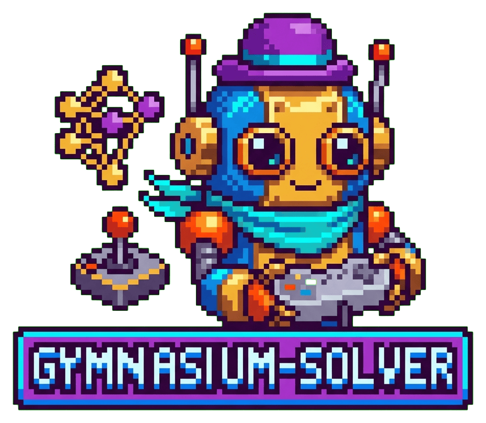
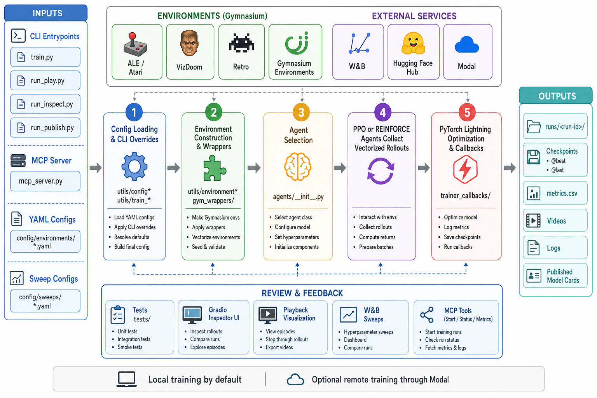

<div align="center">

  

  **🎮 Fast RL framework with PPO and REINFORCE on Gymnasium ⚡**

</div>

gymsolve is a config-first reinforcement learning framework for training PyTorch Lightning agents on Gymnasium environments. It currently supports PPO and REINFORCE, vectorized rollout collection, checkpointed runs, playback tools, and optional W&B, Hugging Face Hub, Modal, Atari, VizDoom, and Retro integrations.

Use it by choosing an environment variant such as `CartPole-v1:ppo`, training from the repo root, then replaying or inspecting a saved run from `runs/`.

## Install

```bash
git clone git@github.com:tsilva/gymsolve.git
cd gymsolve
uv sync
WANDB_MODE=disabled uv run python train.py CartPole-v1:ppo
```

Training writes run artifacts under `runs/<run-id>/`. The latest run is available through `runs/@last`.

## Commands

```bash
uv run python train.py --list-envs                         # list configured targets
WANDB_MODE=disabled uv run python train.py CartPole-v1:ppo # train locally without W&B
uv run python train.py CartPole-v1:ppo --max-env-steps 50000
uv run python train.py --resume @last                      # resume latest run
uv run python run_play.py --run-id @last --episodes 5      # replay a checkpoint
uv run python run_inspect.py --run-id @last --port 7860    # launch inspector UI
uv run python run_publish.py --run-id @last --repo user/repo
uv run pytest -q
```

## Notes

- Python 3.12 or 3.13 is required.
- Environment variants live in `config/environments/*.yaml`; sweep configs live in `config/sweeps/*.yaml`.
- W&B is enabled by default unless `WANDB_MODE=disabled` is set. `.env.example` documents `WANDB_ENTITY` and `WANDB_API_KEY`.
- Hugging Face publishing requires `HF_TOKEN` or a local `huggingface-cli login`.
- Modal training is optional and uses `python train.py <env:variant> --backend modal`; it requires Modal credentials and the expected W&B secret setup.
- Retro support uses the `stable-retro-turbo` package from PyPI on all supported platforms.
- This is a self-education project under active development, so configs, APIs, and stored run formats may change before a formal release.

## Architecture



## License

[MIT](LICENSE)
